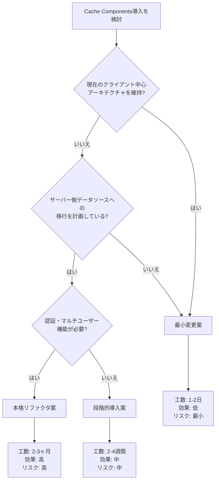

# Cache Components 導入判断ガイド

**対象読者**: プロジェクトオーナー、テックリード  
**前提**: [cache-components-investigation.md](./cache-components-investigation.md) の調査結果を踏まえた判断材料

---

## 判断フローチャート



---

## オプション1: 最小変更案（推奨：現状維持の場合）

### 適用シナリオ
- ✅ 現在のクライアントサイドアーキテクチャを維持したい
- ✅ IndexedDB中心の設計を変更する予定がない
- ✅ 単一ユーザー向けツールとして継続
- ✅ 開発リソースが限られている

### 実装内容

#### 1. OG画像のキャッシュ設定追加

**ファイル**: `app/api/og/route.tsx`

```typescript
// 追加
export const revalidate = 3600 // 1時間キャッシュ

export async function GET(request: NextRequest) {
  // ... 既存コード
}
```

**効果**: 同じ共有リンクのOG画像を1時間キャッシュ、CDNヒット率向上

#### 2. fetchのキャッシュポリシー明示化

**ファイル**: `app/actions/fetch-image.ts`

```typescript
export async function fetchImageAction(url: string): Promise<FetchImageResult> {
  try {
    // ...
    const response = await fetch(url, {
      headers: {
        'User-Agent': 'Mozilla/5.0 (Windows NT 10.0; Win64; x64) AppleWebKit/537.36',
      },
      cache: 'no-store', // 明示的にキャッシュしない（外部画像は常に最新を取得）
      signal: controller.signal,
    })
    // ...
  }
}
```

**効果**: キャッシュ挙動を明示的に制御、デバッグしやすくなる

#### 3. ドキュメント更新

**ファイル**: `next.config.ts`

```typescript
// コメント更新
// Cache Components/PPRは未導入（調査レポート: docs/reports/cache-components-investigation.md）
// 理由: クライアントサイドIndexedDB中心のアーキテクチャのため、サーバー側キャッシュの恩恵が限定的
// 代わりにSuspenseを使用してクライアント側ローディング状態を管理
```

### 工数・リスク評価

| 項目 | 評価 |
|------|------|
| 開発工数 | 1-2日 |
| テスト工数 | 0.5日 |
| リスク | 最小（既存動作に影響なし） |
| 効果 | 低（OG画像のみキャッシュ改善） |
| 保守性向上 | 中（キャッシュ戦略が明示的に） |

### 実装チェックリスト

- [ ] `app/api/og/route.tsx` に `revalidate` 追加
- [ ] `app/actions/fetch-image.ts` の fetch に `cache: 'no-store'` 追加
- [ ] `next.config.ts` のコメント更新
- [ ] E2Eテストで共有リンクのOG画像表示を確認
- [ ] Lighthouseでキャッシュヘッダーを検証

---

## オプション2: 段階的導入案（推奨：将来の拡張を見据える場合）

### 適用シナリオ
- ✅ 将来的にサーバーサイド機能を追加する可能性がある
- ✅ 共有機能の強化（リアルタイムプレビュー等）を検討中
- ✅ パフォーマンス最適化に投資できる
- ✅ 段階的なリスク低減を重視

### 実装ロードマップ

#### フェーズ1: 静的コンテンツの最適化（1週間）

**目的**: Header/Footer等の完全静的部分を `"use cache"` でキャッシュ

**実装例**:

```typescript
// components/layout/cached-header.tsx（新規作成）
"use cache"
import { Header } from './header'

export async function CachedHeader() {
  // Server Componentとして実行、結果がキャッシュされる
  return <Header />
}
```

```typescript
// app/page.tsx（修正）
import { CachedHeader } from "@/components/layout/cached-header"
import { CachedFooter } from "@/components/layout/cached-footer"
// ... Client ComponentはSuspense内で

export default function Home() {
  return (
    <main className="min-h-screen bg-background">
      <CachedHeader /> {/* Server Component, キャッシュ有効 */}
      <ToolDescription />
      <Suspense fallback={<Loading />}>
        <CasesSection /> {/* Client Component, 既存通り */}
      </Suspense>
      <CachedFooter /> {/* Server Component, キャッシュ有効 */}
    </main>
  )
}
```

**効果**: 
- ビルド時にHeader/Footerを一度だけレンダリング
- 再デプロイ時のみ再生成
- 初回表示が若干高速化

#### フェーズ2: 共有プレビューのサーバー化（2週間）

**目的**: 共有CASE機能をServer Componentで実装、`"use cache"` 適用

**実装概要**:
1. 共有CASEデータをサーバーサイドDB（Vercel KV、PostgreSQL等）に保存
2. 共有プレビューページを `/share/[id]` としてServer Component化
3. 画像URLの検証・プレビュー生成を `"use cache"` でキャッシュ

**新規ファイル**: `app/share/[id]/page.tsx`

```typescript
import { notFound } from 'next/navigation'
import { getSharedCase } from '@/lib/server/shared-cases' // 新規: サーバー側DB操作

// この関数全体がキャッシュされる
async function getCachedSharedCase(id: string) {
  "use cache"
  return await getSharedCase(id)
}

export default async function SharePage({ params }: { params: { id: string } }) {
  const sharedCase = await getCachedSharedCase(params.id)
  
  if (!sharedCase) {
    notFound()
  }
  
  return (
    <div>
      <h1>{sharedCase.title}</h1>
      {/* BeforeAfterSliderはClient Componentのまま */}
      <BeforeAfterSlider {...sharedCase} />
    </div>
  )
}
```

**効果**:
- 共有リンクのデータ取得が高速化
- 同じ共有ページへのアクセスはキャッシュから配信
- OG画像との整合性向上

#### フェーズ3: 本格的なPPR適用（追加2週間）

**目的**: メインページでPPRパターンを実現

**実装概要**:
1. ユーザーのCASEデータをサーバーサイドへ移行（オプション）
2. 認証機能追加（NextAuth.js等）
3. `app/page.tsx` を完全なPPRパターンに

```typescript
// app/page.tsx（PPRパターン）
import { Suspense } from 'react'
import { auth } from '@/lib/auth'
import { getCases } from '@/lib/server/cases'

// 静的部分（キャッシュ）
async function StaticShell() {
  "use cache"
  return (
    <>
      <Header />
      <ToolDescription />
    </>
  )
}

// 動的部分（ユーザーごと）
async function DynamicCases() {
  const session = await auth()
  const cases = await getCases(session.userId)
  
  return <CasesDisplay cases={cases} />
}

export default function Home() {
  return (
    <main>
      <StaticShell /> {/* ビルド時生成、全ユーザー共通 */}
      <Suspense fallback={<Loading />}>
        <DynamicCases /> {/* リクエスト時生成、ユーザーごと */}
      </Suspense>
      <Footer />
    </main>
  )
}
```

**効果**:
- 初回表示が劇的に高速化（静的シェルが即座に表示）
- 動的データのみストリーミング
- PPR/Cache Componentsの恩恵を最大化

### 工数・リスク評価

| フェーズ | 開発工数 | リスク | 効果 | 必要インフラ |
|----------|----------|--------|------|--------------|
| 1: 静的最適化 | 3-5日 | 低 | 低〜中 | なし |
| 2: 共有サーバー化 | 1-2週間 | 中 | 中 | DB (Vercel KV等) |
| 3: PPR本格適用 | 1-2週間 | 中〜高 | 高 | DB + 認証 |
| **合計** | **2-4週間** | **中** | **中〜高** | **DB + 認証** |

### 実装チェックリスト（フェーズ1）

- [ ] `components/layout/cached-header.tsx` 作成
- [ ] `components/layout/cached-footer.tsx` 作成
- [ ] `app/page.tsx` で静的コンポーネントを使用
- [ ] ビルドログで「use cache」の効果を確認
- [ ] Lighthouseでパフォーマンススコア測定
- [ ] E2Eテストで既存機能が動作することを確認

---

## オプション3: 本格リファクタ案（推奨：エンタープライズ化の場合）

### 適用シナリオ
- ✅ マルチユーザー・認証機能が必要
- ✅ リアルタイム共同編集を実装したい
- ✅ 大規模なパフォーマンス最適化が必要
- ✅ SaaS化を検討している
- ✅ 十分な開発リソースがある

### アーキテクチャ変更

#### Before: クライアント中心

```
Browser (IndexedDB) → すべてのデータ
↓ 画像フェッチのみサーバー経由
Server (Next.js) → 外部画像プロキシ
```

#### After: サーバー中心 + PPR

```
Browser → Server (Next.js + PPR)
           ↓
           ├─ Static Shell (use cache) → CDN
           ├─ User Data → PostgreSQL
           ├─ Shared Cases → Vercel KV
           └─ Images → S3/Cloudinary
```

### 主要変更点

#### 1. データモデル設計

```typescript
// prisma/schema.prisma（例）
model User {
  id       String  @id @default(cuid())
  email    String  @unique
  cases    Case[]
}

model Case {
  id                    String  @id @default(cuid())
  userId                String
  user                  User    @relation(fields: [userId], references: [id])
  title                 String
  description           String?
  beforeImageUrl        String
  afterImageUrl         String
  view                  Json
  initialSliderPosition Int
  animationType         String
  createdAt             DateTime @default(now())
  updatedAt             DateTime @updatedAt
}
```

#### 2. 認証実装

```typescript
// app/api/auth/[...nextauth]/route.ts
import NextAuth from 'next-auth'
import GoogleProvider from 'next-auth/providers/google'

export const authOptions = {
  providers: [
    GoogleProvider({
      clientId: process.env.GOOGLE_CLIENT_ID!,
      clientSecret: process.env.GOOGLE_CLIENT_SECRET!,
    }),
  ],
}

export const handler = NextAuth(authOptions)
export { handler as GET, handler as POST }
```

#### 3. Cache Components適用

```typescript
// lib/server/cases.ts
"use cache"
export async function getUserCases(userId: string) {
  const cases = await prisma.case.findMany({
    where: { userId },
    orderBy: { order: 'asc' },
  })
  
  return cases
}

// キャッシュの有効期限設定（オプション）
export const cacheLife = {
  "use cache": {
    revalidate: 60, // 60秒ごとに再検証
  }
}
```

#### 4. PPRパターン実装

```typescript
// app/dashboard/page.tsx
import { Suspense } from 'react'
import { auth } from '@/lib/auth'
import { getUserCases } from '@/lib/server/cases'

// 静的シェル（全ユーザー共通、キャッシュ）
async function DashboardShell() {
  "use cache"
  return (
    <div>
      <DashboardHeader />
      <DashboardSidebar />
    </div>
  )
}

// 動的データ（ユーザーごと）
async function UserCases() {
  const session = await auth()
  const cases = await getUserCases(session.user.id)
  
  return <CasesList cases={cases} />
}

export default function Dashboard() {
  return (
    <>
      <DashboardShell /> {/* PPR: 静的部分 */}
      <Suspense fallback={<CasesLoading />}>
        <UserCases /> {/* PPR: 動的部分 */}
      </Suspense>
    </>
  )
}
```

### 工数・リスク評価

| 項目 | 評価 |
|------|------|
| 開発工数 | 2-3ヶ月 |
| テスト工数 | 2-3週間 |
| インフラ設計 | 1-2週間 |
| データ移行 | 1週間 |
| リスク | 高（アーキテクチャ全面変更） |
| 効果 | 最大（パフォーマンス・スケーラビリティ大幅向上） |
| インフラコスト | 中〜高（DB、認証、ストレージ） |

### 実装チェックリスト

#### インフラ
- [ ] データベース選定・構築（PostgreSQL + Prisma推奨）
- [ ] 認証プロバイダー設定（NextAuth.js）
- [ ] 画像ストレージ設定（S3/Cloudinary）
- [ ] キャッシュストレージ（Vercel KV/Redis）

#### バックエンド
- [ ] Prismaスキーマ設計
- [ ] マイグレーション作成
- [ ] Server Actions/API Routes実装
- [ ] `"use cache"` 適用箇所の設計

#### フロントエンド
- [ ] Server Component化（メインUI）
- [ ] Client Componentの最小化
- [ ] PPRパターン実装
- [ ] 認証UIの実装

#### データ移行
- [ ] IndexedDBからサーバーDBへの移行スクリプト
- [ ] 既存ユーザーのデータ保全戦略

#### テスト
- [ ] E2Eテスト全面書き直し
- [ ] 負荷テスト
- [ ] セキュリティ監査

---

## 推奨決定マトリクス

| 要件 | オプション1 | オプション2 | オプション3 |
|------|:-----------:|:-----------:|:-----------:|
| **現状維持** | ⭐⭐⭐ | ⭐ | - |
| **低リスク** | ⭐⭐⭐ | ⭐⭐ | - |
| **低工数** | ⭐⭐⭐ | ⭐ | - |
| **段階的拡張** | - | ⭐⭐⭐ | ⭐ |
| **パフォーマンス向上** | ⭐ | ⭐⭐ | ⭐⭐⭐ |
| **マルチユーザー対応** | - | ⭐ | ⭐⭐⭐ |
| **Cache Components活用** | - | ⭐⭐ | ⭐⭐⭐ |
| **SaaS化可能** | - | ⭐ | ⭐⭐⭐ |

---

## まとめ：プロジェクト特性別の推奨

### 🎯 個人ツール・社内ツールとして継続
→ **オプション1（最小変更）** を推奨

理由：
- IndexedDBの利点（オフライン動作、サーバーコストゼロ）を維持
- Cache Componentsの恩恵は限定的
- 開発コストを他機能に投資できる

### 🎯 共有機能の強化・将来の拡張に備える
→ **オプション2（段階的導入）** を推奨

理由：
- フェーズごとに効果を検証しながら進められる
- 初期投資を抑えつつ、将来の拡張性を確保
- Cache Componentsの学習・実践機会

### 🎯 SaaS化・エンタープライズ対応
→ **オプション3（本格リファクタ）** を推奨

理由：
- マルチユーザー・認証が必須
- パフォーマンス・スケーラビリティが重要
- Cache Components/PPRの恩恵を最大化

---

## 次のアクション

1. **要件の明確化**: 上記シナリオに当てはまるかを確認
2. **工数・予算の確保**: 選択したオプションに応じたリソース確保
3. **実装計画の作成**: 具体的なタスク分解とスケジューリング
4. **テスト戦略の策定**: 既存機能の保全とパフォーマンス検証

---

**質問・相談先**: プロジェクトテックリード  
**関連ドキュメント**: [cache-components-investigation.md](./cache-components-investigation.md)

