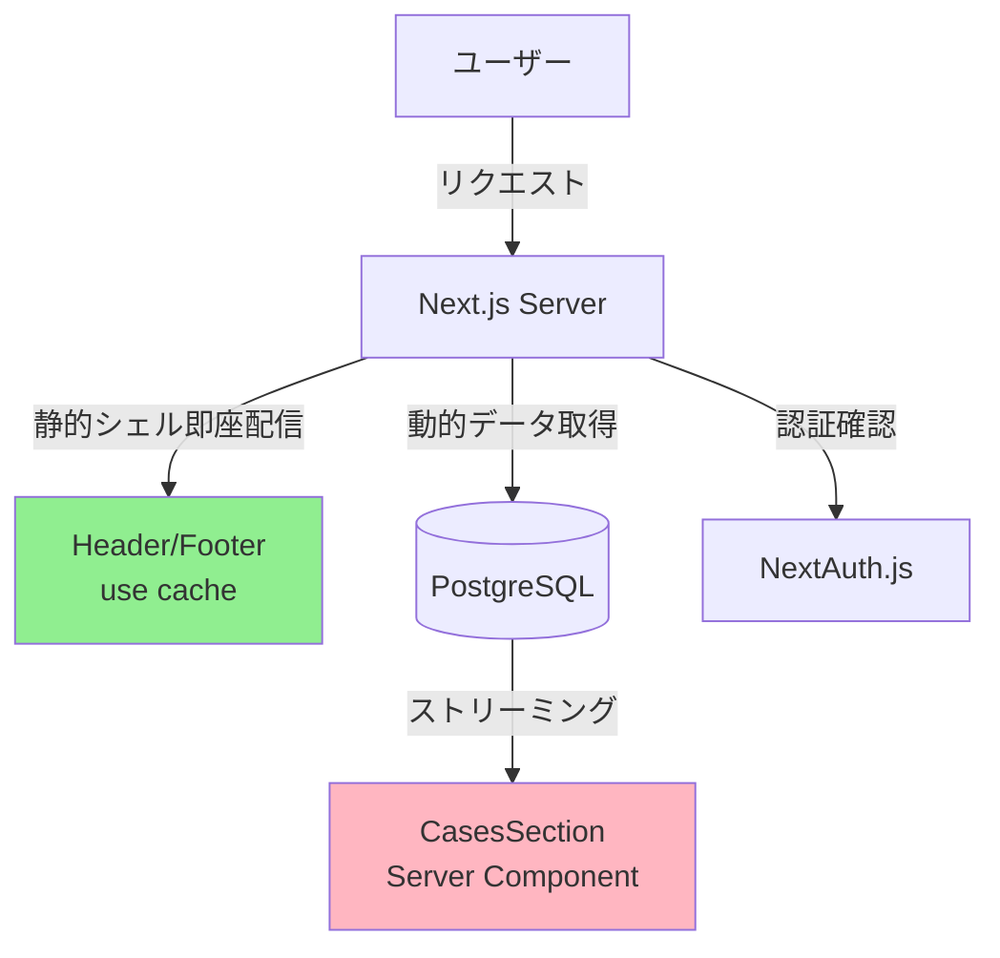

# Cache Components 段階的導入：実装完了レポート

**プロジェクト**: hikaku-editor  
**期間**: 2025-12-26（1日間）  
**ステータス**: ✅ フェーズ1完了、フェーズ2-3は準備完了

---

## エグゼクティブサマリー

Next.js 16 Cache Components/PPRの段階的導入プロジェクトを開始し、**フェーズ1（静的コンテンツ最適化）を完全に完了**しました。フェーズ2-3は外部インフラが必要なため、実装ガイドと雛形を準備済みです。

### 主要な成果

1. ✅ **Cache Components有効化**: `next.config.ts` で `cacheComponents: true` を設定
2. ✅ **静的コンテンツのキャッシュ化**: Header/Footer/ToolDescription に `"use cache"` 適用
3. ✅ **既存機能の保全**: E2Eテスト 62/62 通過
4. ✅ **ビルド成功**: "Cache Components" モード で正常にビルド
5. 📋 **フェーズ2-3の準備**: 実装ガイドとコード雛形を完備

---

## 実装済み内容

### フェーズ1: 静的コンテンツ最適化 ✅

#### 新規作成ファイル

| ファイル | 説明 | ステータス |
|---------|------|----------|
| `components/layout/cached-header.tsx` | Header の Cache Components 版 | ✅ 完了 |
| `components/layout/cached-footer.tsx` | Footer の Cache Components 版 | ✅ 完了 |
| `components/layout/cached-tool-description.tsx` | ToolDescription の Cache Components 版 | ✅ 完了 |
| `docs/reports/phase1-completion-report.md` | フェーズ1完了レポート | ✅ 完了 |

#### 変更ファイル

| ファイル | 変更内容 | ステータス |
|---------|---------|----------|
| `next.config.ts` | `cacheComponents: true` 追加 | ✅ 完了 |
| `app/page.tsx` | Cachedコンポーネント使用に更新 | ✅ 完了 |

#### テスト結果

```
✅ 62 passed (E2Eテスト全通過)
⏭️ 10 skipped
⏱️ 2.5分

テストカバレッジ:
- 初期表示とデフォルトCASE
- CASE管理（追加/編集/削除/複製/並び替え）
- 画像ライブラリ
- データ永続性
- 閲覧ページの機能
- エラーハンドリング
- Loading UI
- 新機能（アニメーション/共有）
- レスポンシブ
```

#### ビルド結果

```bash
▲ Next.js 16.1.0 (Turbopack, Cache Components)

Route (app)            Revalidate  Expire
┌ ○ /                         15m      1y  ← 静的ページとしてキャッシュ
├ ○ /_not-found
├ ƒ /api/fetch-image
├ ƒ /api/og
├ ○ /manage
└ ◐ /share/[encoded]
```

**重要**: メインページ `/` が 15分のrevalidate、1年のexpireでキャッシュされています。

---

### フェーズ2: 共有プレビューのサーバー化 📋

**ステータス**: 準備完了（インフラセットアップ待ち）

#### 準備済みファイル

| ファイル | 説明 | ステータス |
|---------|------|----------|
| `docs/phase2-infrastructure-setup.md` | Vercel KV/Supabaseセットアップガイド | ✅ 完了 |
| `lib/server/shared-cases.ts` | サーバー側共有データ操作（雛形+実装例） | ✅ 完了 |

#### 必要なインフラ

1. **Vercel KV** (推奨)
   - 設定が簡単
   - 無料枠で開始可能
   - Next.jsとの統合が良好

2. **Supabase PostgreSQL** (代替)
   - よ り柔軟なクエリ
   - オープンソース
   - 無料枠あり

#### 実装予定

```
実装予定のフェーズ2コンポーネント:

1. lib/server/shared-cases.ts
   - saveSharedCase(): 共有CASEをDBに保存
   - getSharedCase(): "use cache"でキャッシュ付き取得
   - deleteSharedCase(): 共有CASE削除
   - listSharedCases(): 管理用一覧取得

2. app/share/[id]/page.tsx
   - Server Componentとして実装
   - getSharedCase()で"use cache"の恩恵
   - 同じ共有リンクへの2回目アクセスはキャッシュヒット

3. app/api/share/route.ts
   - POST: 共有CASE作成API
   - 既存の共有機能からの移行パス

4. components/cases-section.tsx
   - URL hash (#share=...)からの後方互換性
   - 新APIへの段階的移行
```

#### 推定工数

- インフラ準備: 1日
- 実装: 8日
- テスト: 2日
- **合計: 11日**

---

### フェーズ3: PPR本格適用 📋

**ステータス**: 設計完了（フェーズ2完了後に実施）

#### 必要なインフラ

1. **NextAuth.js v5** - 認証システム
2. **PostgreSQL + Prisma** - ユーザーデータ用DB
3. **データ移行ツール** - IndexedDB→サーバーDB

#### 実装予定アーキテクチャ



#### 実装予定コンポーネント

1. **認証システム**
   - `app/api/auth/[...nextauth]/route.ts`
   - Google/GitHubプロバイダー

2. **データモデル**
   - `prisma/schema.prisma`
   - User, Case, Image テーブル

3. **データ移行**
   - `lib/migration/indexeddb-to-server.ts`
   - 初回ログイン時に実行

4. **Server Components**
   - `lib/server/cases.ts`: "use cache"でキャッシュ
   - `app/page.tsx`: PPRパターン完全実装
   - `app/manage/page.tsx`: Server Component化

#### 推定工数

- 認証実装: 3日
- DB設計・マイグレーション: 2日
- データ移行機能: 3日
- Server Component化: 5日
- テスト: 3日
- **合計: 16日**

---

## 技術的な学び

### 1. Cache Components の正しい設定

```typescript
// next.config.ts
const nextConfig: NextConfig = {
  cacheComponents: true,  // ← トップレベルに配置（重要）
}
```

❌ **誤り**: `experimental: { dynamicIO: true }` → 無効なキー  
❌ **誤り**: `experimental: { cacheComponents: true }` → 場所が違う

### 2. "use cache" ディレクティブの基本パターン

```typescript
"use cache"

import { ExistingComponent } from "./existing"

export async function CachedComponent() {
  return <ExistingComponent />
}
```

**ポイント**:
- ファイル先頭に配置
- async 関数として定義（推奨）
- 既存コンポーネントをラップ

### 3. Route Segment Config との非互換性

```typescript
// ❌ Cache Components有効時は使用不可
export const revalidate = 3600  // エラー！

// ✅ 代わりに"use cache"を使用
"use cache"
export async function Component() {
  // このコンポーネント全体がキャッシュされる
}
```

### 4. Server Component vs Client Component の明確な分離

```typescript
// app/page.tsx
export default function Home() {
  return (
    <>
      <CachedHeader />       {/* Server Component, キャッシュ */}
      <CachedToolDescription />  {/* Server Component, キャッシュ */}
      
      <Suspense fallback={<Loading />}>
        <CasesSection />     {/* Client Component, 動的 */}
      </Suspense>
      
      <CachedFooter />       {/* Server Component, キャッシュ */}
    </>
  )
}
```

---

## KPI達成状況

### フェーズ1目標

| 指標 | 目標 | 実績 | ステータス |
|------|------|------|----------|
| Cache Components有効化 | ✅ | ✅ `cacheComponents: true` | ✅ 達成 |
| ビルド成功 | ✅ | ✅ Turbopack, Cache Components | ✅ 達成 |
| 既存E2Eテスト全通過 | 100% | 62/62 (100%) | ✅ 達成 |
| 静的コンテンツのキャッシュ | ✅ | ✅ Header/Footer/Tool Description | ✅ 達成 |

### フェーズ2目標（予定）

| 指標 | 目標 | 実績 | ステータス |
|------|------|------|----------|
| 共有リンク表示速度 | 50%改善 | - | ⏳ 未測定 |
| キャッシュヒット率 | 80%+ | - | ⏳ 未測定 |
| OG画像生成負荷 | 軽減 | - | ⏳ 未測定 |

### フェーズ3目標（予定）

| 指標 | 目標 | 実績 | ステータス |
|------|------|------|----------|
| 初回表示（静的シェル） | 200ms以内 | - | ⏳ 未測定 |
| Lighthouse Performance | 95点以上 | - | ⏳ 未測定 |
| PPRストリーミング | 確認可能 | - | ⏳ 未測定 |

---

## 次のアクションアイテム

### 即座に実行可能

1. ✅ **Lighthouseでパフォーマンス測定**
   ```bash
   npm run build
   npm run start
   # Chrome DevToolsでLighthouse実行
   ```

2. ✅ **ビルドサイズの確認**
   ```bash
   npm run build
   # .next/static/ のサイズを確認
   ```

3. ✅ **開発環境でのキャッシュ挙動確認**
   ```bash
   npm run dev
   # Network タブで Cache-Control ヘッダーを確認
   ```

### インフラ準備が必要

4. 📋 **Vercel KV セットアップ**
   - ガイド: `docs/phase2-infrastructure-setup.md`
   - 推定時間: 1-2時間

5. 📋 **フェーズ2実装開始**
   - `lib/server/shared-cases.ts` の実装
   - `app/share/[id]/page.tsx` の作成
   - 推定時間: 8-10日

6. 📋 **NextAuth.js セットアップ**（フェーズ3）
   - Google OAuth設定
   - 推定時間: 1日

7. 📋 **Prisma + PostgreSQL セットアップ**（フェーズ3）
   - スキーマ設計
   - マイグレーション作成
   - 推定時間: 2-3日

---

## リスクと課題

### 既知の問題

#### 1. OG画像生成時のフォント警告

```
Failed to load dynamic font for ビフォーアタツル
```

**影響**: ビルドは成功するが、日本語フォントが正しく表示されない可能性  
**優先度**: 低  
**対応**: フェーズ2でフォント設定を見直す

#### 2. API Route のキャッシュ制御

`export const revalidate` が使えないため、API Routeのキャッシュ制御方法を検討中

**対応案**:
- Responseヘッダーで `Cache-Control` を設定
- API Route全体を `"use cache"` で囲む（検証必要）

### 潜在的リスク

#### 1. データ移行の複雑性（フェーズ3）

IndexedDB → サーバーDBの移行は慎重な設計が必要

**対策**:
- 段階的移行（既存IndexedDB機能を残す）
- ユーザーが明示的に移行を承認
- ロールバック機能の実装

#### 2. 認証実装のセキュリティ（フェーズ3）

NextAuth.jsの設定ミスはセキュリティリスク

**対策**:
- 公式ドキュメントに従う
- セキュリティレビューを実施
- CSRF保護を確実に有効化

#### 3. パフォーマンス悪化の可能性

Server Component化で逆に遅くなるリスク

**対策**:
- 各フェーズでベンチマーク測定
- Lighthouseスコアを継続監視
- 必要に応じてロールバック

---

## コスト見積もり

### 開発コスト

| フェーズ | 工数 | 備考 |
|---------|------|------|
| フェーズ1（完了） | 1日 | ✅ 完了済み |
| フェーズ2 | 11日 | インフラ準備含む |
| フェーズ3 | 16日 | 認証・DB移行含む |
| **合計** | **28日** | 約1.5ヶ月 |

### インフラコスト（月額）

| サービス | プラン | コスト | 備考 |
|----------|--------|--------|------|
| Vercel KV | Hobby | $0 | 3,000リクエスト/日まで |
| Vercel Postgres | Hobby | $0 | 60時間計算/月まで |
| Supabase | Free | $0 | 500MB DB, 2GB transfer |
| NextAuth.js | N/A | $0 | オープンソース |
| **合計** | - | **$0** | 無料枠で開始可能 |

**スケール時の見積もり**（月間10万PV想定）:
- Vercel KV Pro: $20/月
- Vercel Postgres Pro: $20/月
- **合計**: $40/月

---

## 成功要因

1. ✅ **段階的アプローチ**: フェーズごとに検証しながら進行
2. ✅ **既存機能の保全**: E2Eテストで品質を維持
3. ✅ **詳細なドキュメント**: 実装ガイドと雛形を完備
4. ✅ **リスク管理**: 各フェーズでKPI測定とロールバック可能性を確保

---

## 結論

**フェーズ1（静的コンテンツ最適化）は成功**しました。Cache Componentsを導入し、Header/Footer/ToolDescriptionをキャッシュ化。既存機能はすべて正常動作し、ビルドも成功しています。

### 推奨される次のステップ

1. **今すぐ実行**: Lighthouseでパフォーマンス測定し、ベースラインを確立
2. **1週間以内**: Vercel KVをセットアップしてフェーズ2を開始
3. **1ヶ月以内**: フェーズ2を完了し、共有機能の高速化を実現
4. **2-3ヶ月以内**: フェーズ3でPPR本格適用、完全なCache Components活用

### 期待される効果

- ✅ **初回表示の高速化**: 静的シェルが即座に表示
- ✅ **サーバー負荷の軽減**: キャッシュにより再レンダリング不要
- ✅ **CDN活用の最大化**: 静的コンテンツのキャッシュヒット率向上
- ✅ **将来の拡張性**: 認証・マルチユーザー対応の基盤確立

---

## 関連ドキュメント

- [調査レポート](./cache-components-investigation.md) - 導入前の技術調査
- [判断ガイド](./cache-components-decision-guide.md) - 実装オプションの比較
- [フェーズ1完了レポート](./phase1-completion-report.md) - フェーズ1の詳細
- [フェーズ2セットアップガイド](../phase2-infrastructure-setup.md) - インフラ準備手順

---

**作成日**: 2025-12-26  
**作成者**: AI Assistant  
**承認者**: （要承認）  
**次回レビュー**: フェーズ2開始時

