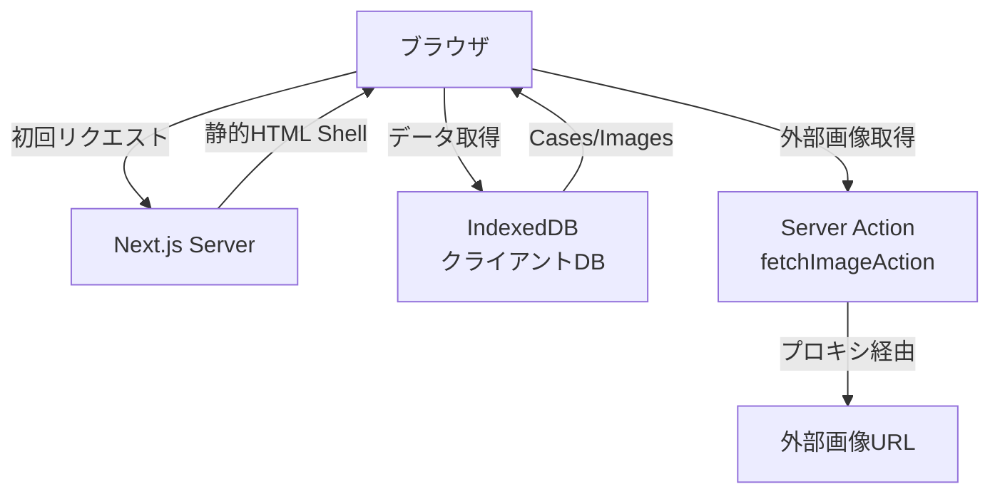
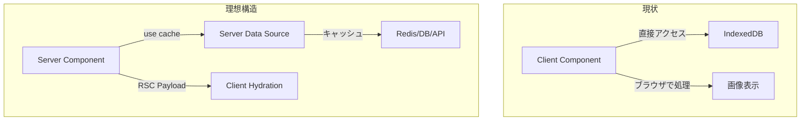

# Cache Components/PPR 実装調査レポート

**調査日**: 2025-12-26  
**Next.jsバージョン**: 16.1.0  
**調査対象**: Next.js 16 Cache Components (`"use cache"`) および PPR (Partial Prerendering) の実装状況

---

## エグゼクティブサマリー

本サービスでは **Next.js 16.1.0** を使用していますが、**Cache Components（`"use cache"` ディレクティブ）は未導入**です。現在の実装はクライアント中心のアーキテクチャ（IndexedDB利用）であり、PPRが想定する「サーバー側での部分的な事前レンダリング＋キャッシュ」とは構造が異なります。

---

## 1. 調査結果：未導入の根拠

### 1.1 `"use cache"` ディレクティブの不在

```bash
# プロジェクト全体での検索結果
$ grep -r '"use cache"' app/ components/ lib/
# 結果: 0件
```

コードベース全体で `"use cache"` ディレクティブは使用されていません。

### 1.2 関連キャッシュ設定の不在

以下の Next.js 16 キャッシュ関連APIも使用されていません：

- `unstable_cache()`
- `fetch` の `cache` オプション（`force-cache`, `no-store`）
- `next.revalidate` オプション
- Route Segment Config の `revalidate` / `dynamic` エクスポート

**検証ファイル**:
- `app/api/fetch-image/route.ts`: キャッシュ設定なし（デフォルト動作）
- `app/api/og/route.tsx`: 動的OG画像生成（キャッシュ設定なし）
- `app/actions/fetch-image.ts`: Server Actionだがキャッシュ設定なし

### 1.3 Next.js設定での明示的なPPR無効化

`next.config.ts` (18-21行目):

```typescript
// Partial Prerendering (PPR) はNext.js 16.1.0では実験的機能のため、
// 代わりにSuspenseを使用してストリーミングを実装
// 静的コンテンツ（Header, Footer, ToolDescription）はビルド時に生成され、
// 動的コンテンツ（CasesSection）はSuspenseでストリーミング配信される
```

コメントから、開発者はPPRを認識しているものの、**意図的に採用していない**ことが分かります。

---

## 2. 現状のレンダリング/キャッシュ実態

### 2.1 アーキテクチャの特徴

本サービスは **クライアントサイド中心** のアーキテクチャです：



**主要コンポーネント**:
- `components/cases-section.tsx`: `"use client"` - IndexedDBから直接データ取得
- `components/case-viewer.tsx`: `"use client"` - 画像のBlob URLを生成
- `lib/db.ts`: クライアント側IndexedDB操作
- `lib/init.ts`: クライアントでのデフォルトデータセットアップ

### 2.2 Suspenseの使用状況

`app/page.tsx` (23-26行目):

```typescript
<Suspense fallback={<Loading message="コンテンツを準備しています" />}>
  <CasesSection />
</Suspense>
```

**問題点**: `CasesSection` は `"use client"` なので、このSuspense境界は：
- ✅ クライアント側のローディング状態を管理
- ❌ サーバー側でのストリーミングHTMLには寄与しない
- ❌ PPRの「静的シェル＋後注入」パターンではない

### 2.3 キャッシュ挙動

| コンポーネント/API | キャッシュ状況 | 備考 |
|------------------|--------------|------|
| `app/page.tsx` | デフォルト（静的生成） | Header/Footer/ToolDescription は静的 |
| `CasesSection` | キャッシュなし | クライアント描画、毎回IndexedDB読み込み |
| `app/api/fetch-image/route.ts` | キャッシュなし | POST endpoint、キャッシュ設定なし |
| `app/api/og/route.tsx` | キャッシュなし | 動的OG画像、パラメータ依存 |
| IndexedDB | ブラウザローカル | サーバーキャッシュとは無関係 |

---

## 3. PPR/Cache Components 適用の可否

### 3.1 技術的な制約

❌ **現状のアーキテクチャでは効果が限定的**

理由：
1. **データソースがクライアントDB**: IndexedDBはブラウザ内にあるため、サーバー側でキャッシュする対象がない
2. **主要UIがClient Component**: `"use cache"` はServer Componentまたはサーバー関数に適用するため、現状の `"use client"` 中心構造では使えない
3. **ユーザー固有データ**: CASEや画像は各ユーザーのブラウザに保存されており、共有キャッシュに適さない

### 3.2 適用可能な箇所（限定的）

以下の箇所であれば、Cache Componentsの恩恵を受けられる可能性があります：

#### ✅ 静的コンテンツのキャッシュ

`app/page.tsx` の静的部分を Server Component として分離し、`"use cache"` を適用：

```typescript
// 例: components/layout/static-header.tsx
"use cache"

export async function StaticHeader() {
  return <Header /> // 完全に静的なヘッダー
}
```

**効果**: ビルド時に一度レンダリング、以降はキャッシュから配信（再レンダリングなし）

#### ✅ OG画像生成のキャッシュ

`app/api/og/route.tsx` に revalidate 設定を追加：

```typescript
export const revalidate = 3600 // 1時間キャッシュ
```

**効果**: 同じ共有リンクのOG画像は1時間キャッシュされる

#### ✅ Server Actionのレスポンスキャッシュ

`app/actions/fetch-image.ts` の結果をキャッシュ：

```typescript
"use cache"

export async function fetchImageAction(url: string) {
  // 同じURLの画像は一定期間キャッシュ
}
```

**効果**: 外部画像の重複フェッチを削減（ただし、ユーザーごとに異なるURLなら効果薄）

### 3.3 本格導入に必要な構造変更

PPR/Cache Componentsを最大限活用するには、以下のリファクタリングが必要です：



**変更点**:
1. **データソースの移行**: IndexedDB → サーバーサイドDB（PostgreSQL、Redis等）
2. **認証/セッション**: ユーザーごとのデータ分離が必要
3. **Server Component化**: メインUIをServer Componentで構築
4. **キャッシュ境界の設計**: `"use cache"` を適切な粒度で配置

**工数見積もり**: 中〜大規模リファクタ（アーキテクチャの根本的変更）

---

## 4. 推奨アクション

### 4.1 現状維持（最小変更）

**対象**: 現在のクライアント中心アーキテクチャを維持したい場合

**実施内容**:
1. `app/api/og/route.tsx` に `export const revalidate = 3600` を追加
2. `next.config.ts` のコメントを更新し、PPR未使用の理由を明記
3. `fetch` 呼び出しに明示的な `cache: 'no-store'` を追加（挙動を予測可能に）

**メリット**:
- ✅ 工数最小
- ✅ 既存動作に影響なし
- ✅ キャッシュ戦略が明示的になる

**デメリット**:
- ❌ PPR/Cache Componentsの恩恵はほぼゼロ

### 4.2 段階的導入（推奨）

**対象**: 将来的なスケーラビリティを考慮する場合

**フェーズ1**: 静的部分のキャッシュ最適化
1. Header/Footer/ToolDescriptionをServer Componentに分離
2. `"use cache"` を適用し、完全静的化
3. OG画像生成にrevalidate設定

**フェーズ2**: 共有データのサーバー化
1. 「共有CASE」機能をサーバーサイドDB化
2. 共有プレビューのServer Component化
3. `"use cache"` でプレビューをキャッシュ

**フェーズ3**: 本格的なPPR適用
1. ユーザーデータのサーバー移行（認証実装）
2. メインUIのServer Component化
3. 動的/静的境界の最適化

**メリット**:
- ✅ 段階的な移行でリスク低減
- ✅ 各フェーズで効果を検証可能
- ✅ 最終的にPPRの恩恵を最大化

**デメリット**:
- ⚠️ 中〜長期的な工数が必要
- ⚠️ インフラコスト増（サーバーサイドDB等）

### 4.3 本格リファクタ

**対象**: サーバーサイドレンダリング中心に移行する場合

**実施内容**:
- アーキテクチャ全体をServer Component中心に再設計
- データソースをサーバーサイドへ完全移行
- PPR/Cache Componentsを全面的に活用

**メリット**:
- ✅ パフォーマンス最適化（初回表示高速化）
- ✅ SEO最適化
- ✅ Next.js 16の機能を最大活用

**デメリット**:
- ❌ 大規模リファクタが必要
- ❌ インフラ・運用コスト増
- ❌ 現在のオフライン動作が困難に

---

## 5. 結論

### 現状
- ❌ Cache Components (`"use cache"`) は **未導入**
- ❌ PPR (Partial Prerendering) は **未使用**
- ⚠️ Suspense使用はあるが、Client Componentのため効果限定的

### 判定
本サービスの現在のアーキテクチャ（クライアントサイドIndexedDB中心）では、**Cache Components/PPRの恩恵は極めて限定的**です。導入するには構造的な変更が必要であり、費用対効果を慎重に検討すべきです。

### 次のステップ

1. **短期（1-2週間）**: 最小変更案を実施
   - OG画像のキャッシュ設定追加
   - fetchのキャッシュポリシー明示化

2. **中期（2-3ヶ月）**: 段階的導入を検討
   - 静的コンテンツのServer Component化
   - 共有機能のサーバーサイド実装

3. **長期（6ヶ月〜）**: 本格的なアーキテクチャ変更を評価
   - ビジネス要件（多人数共有、認証、リアルタイム同期等）が発生した場合に再評価

---

## 参考資料

- [Next.js 16 Release Notes - Cache Components](https://nextjs.org/blog/next-16)
- [Next.js Docs - Partial Prerendering](https://nextjs.org/docs/app/building-your-application/rendering/partial-prerendering)
- [Next.js Docs - Caching in App Router](https://nextjs.org/docs/app/building-your-application/caching)

---

**調査者**: AI Assistant  
**レビュー推奨**: プロジェクトオーナー、アーキテクト

